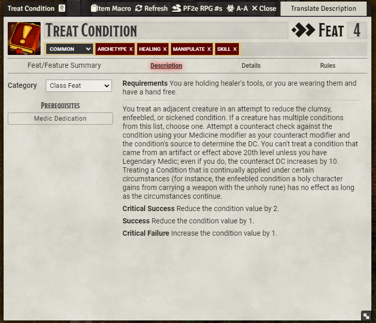
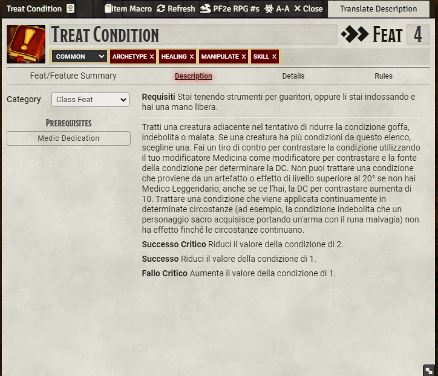
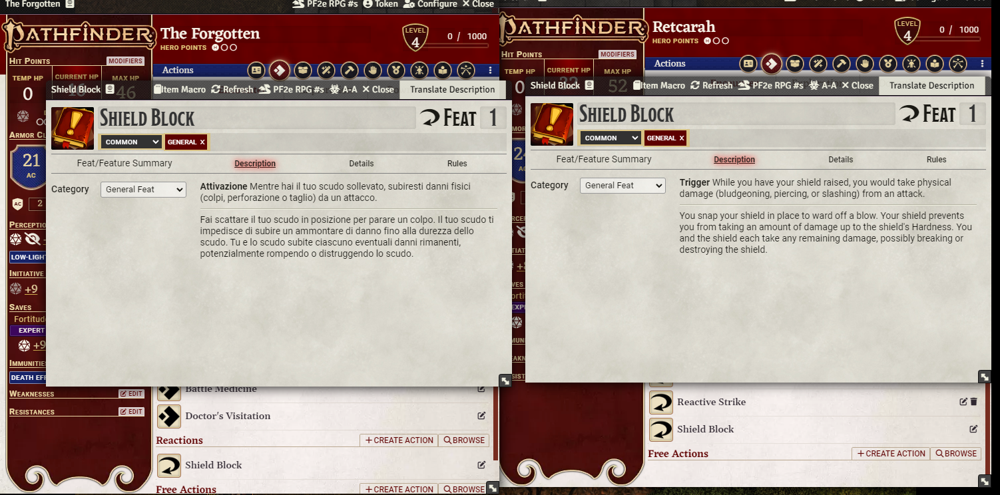

# FoundryVTT Translate ALL

A small module for FoundryVTT that enable to translate:
- Spells 
- Items
- Abilities
- Journal Entries

into your specified language. 

## How to set it up
1. Go go to https://platform.openai.com/
2. Obtain an API-KEY https://platform.openai.com/api-keys
   - warning: the API will disappear, copy it in a SAFE PLACE  
   - set the limit of spending. I'm using 4o-mini that is not very expensive. But please set limits, I'm not responsible for your spending. You have a couple of days of free trial. 
   - Overall the cost is very low and depend onw how many words you send. Check the pricing!
3. Set the Key inside FoundryVTT
4. Translate ALL!

## How does it work

There is a new button where a translation could be possible. 

after you click it just wait a couple of second and the text will be changed. 

## Limitations

Is not possible, right now, to translate compendium item. You can import the item, or else, translate it and then assign it to the player. 

Or you can translate directly inside player or monster sheets the ability or spell. This will change the LOCAL usage of that. The same ability for two player need two translations right now. 

## CHANGELOG

You can see the changelog [HERE](./CHANGELOG.md)

## Contribution

Any contribution is welcomed, feature will be very slow and only if there is interest. For my personal use this is more then good. 
You can find a list of todo [HERE](./TODO.md). Is not in order of priority.