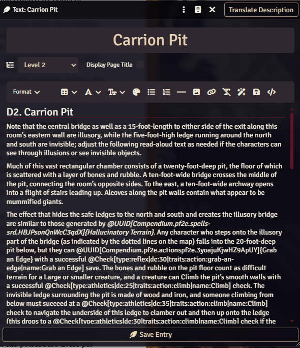
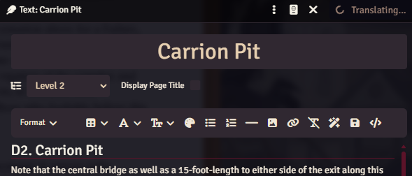
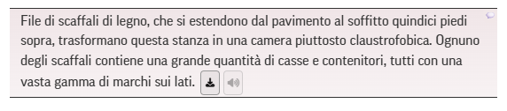
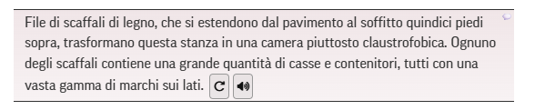
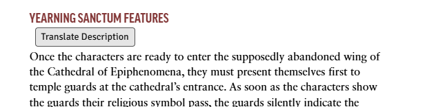

# FoundryVTT Translate ALL


A small module for FoundryVTT that allows you to translate:
- Spells  
- Items  
- Abilities  
- Journal Entries  

into your specified language.

---

## Setup Instructions

1. Visit [https://platform.openai.com/](https://platform.openai.com/)
2. Get your API key: [https://platform.openai.com/api-keys](https://platform.openai.com/api-keys)  
   - ⚠️ **Important:** The key will only be shown once. Copy it and store it somewhere safe.  
   - Set a **spending limit**. I'm using `o4-mini`, which is very affordable. Still, set a budget — I'm not responsible for any charges.  
   - You'll get a free trial with some usage credits.  
   - Costs are generally low and depend on how many words you translate. Check [OpenAI pricing](https://openai.com/pricing).
3. Enter the API key in the FoundryVTT module settings.
4. You're ready to Translate ALL!

---

## How It Works

A new **"Translate"** button will appear where translation is supported:  


After clicking it, a spinner will appear. Wait for it to finish:  


The page will automatically close when finished, and the translation should be in place.

---

## Experimental: Read-Aloud Text-to-Speech (PF2E only)

For the **Pathfinder 2e** system, the module can also synthesize the boxed read-aloud passages (`<p class="read-aloud">`) into spoken audio using OpenAI's TTS API, and save them as MP3 files inside your Foundry Data folder so they can be replayed instantly by any client.

Before enabling the feature, paragraphs look like this:



Once enabled, two small buttons appear next to each paragraph:



- **Generate** (download icon) — calls the TTS API and saves the resulting MP3 to `Data/translateAll/textToSpeech/<hash>.mp3`. Becomes a *regenerate* icon once an audio file exists.
- **Play** (speaker icon) — disabled until the audio has been generated. Toggles between play and pause; the icon updates accordingly.

File names are a hash of *text + voice + model + instructions*, so:
- Identical passages with the same settings reuse the same audio file (no re-billing).
- Changing voice, model, or instructions produces a new file; the old one stays on disk.

### Enabling and configuring TTS

In module settings, scroll to the TTS section and:

1. Toggle **Enable Read-Aloud TTS**.
2. Optionally set **TTS API Endpoint** and **TTS API Key** — leave them empty to reuse the translation endpoint/key.
3. Pick a **TTS Model** (`tts-1`, `tts-1-hd`, or the steerable `gpt-4o-mini-tts`).
4. Pick a **TTS Voice** (alloy, ash, ballad, coral, echo, fable, onyx, nova, sage, shimmer, verse).
5. Optionally fill **TTS Voice Instructions** with a free-form style prompt (only honored by `gpt-4o-mini-tts`), for example:

   ```
   Italian Dungeon Master narrating a tabletop RPG boxed text. Slow, measured pacing,
   warm but ominous tone. Native Italian accent. Treat punctuation as breath.
   Avoid English intonation, theatrical over-acting, and sound effects.
   ```

6. Optionally change **TTS Audio Folder** if you prefer a different location inside `Data/`.

> The **Generate** button requires GM permissions (Foundry blocks file uploads from players). Once the file exists on disk, any connected client can press Play.

---

## Known Issues

- On some occasions, an extra button may appear in the journal. Do not click it.



---

## Options

- If you would like to use the default prompt, leave the prompt file selection empty.

---

## Changelog

View the full changelog [HERE](./CHANGELOG.md)

---

## Contributions

Contributions are welcome! Feature development will be slow and based on community interest. For personal use, the module is already sufficient.

You can find the current to-do list [HERE](./TODO.md). Tasks are not listed in order of priority.
